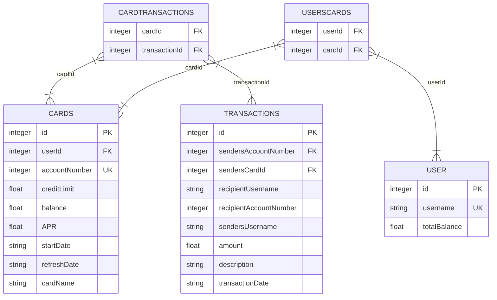

# Card Flex

# Coding Conventions

CARD FLEX CODING PRINCIPALS
1. camelCase for variable names
2. PascalCase for class names
3. Main dir contains:

        i. App.java and DB.java.
        ii. Model folder that contains classes.
        iii. Repository folder that contains Classes regarding DB Communication
        iii. HTML folder for static webpages.
4. Commenting rules: \
   Leave your name on every comment. \
   For every method: Describe the function in layman's terms. Specify what classes the function interacts with.\
   Do not push commented out code. Ensure comments describe the code.
5. Variable names must be explicit.
6. Relevant commit names.
7. Branch names should contain: ticketName.
8. Errors: Use try / catch where you can. \
   Ensure you throw relevant error based on root cause.
9. Semi-semantic HTML.
10. OUR MAIN COLOUR: Bright Blue(#006FCF) Deep Blue(#00175A)
11. OUR MAIN BACKGROUND: Gray (#F7F8F9)
12. DB main tables: User, Card, Transactions.
13. Pull requests must be peer-reviewed by a different pair before acceptance.