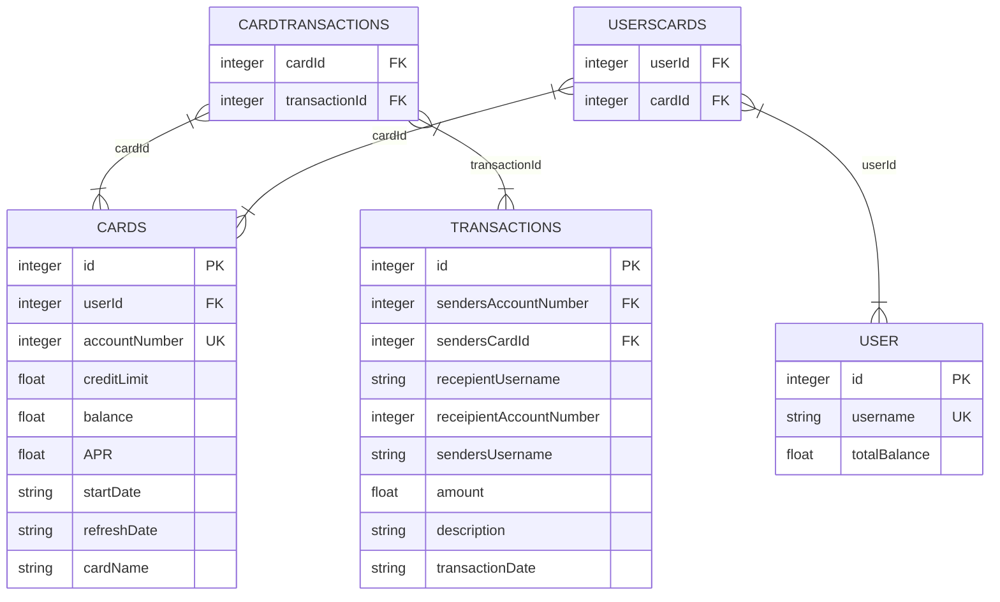

# Card Flex

```mermaid

erDiagram
CARDTRANSACTIONS |{ --|{CARDS: cardId
CARDTRANSACTIONS |{ --|{TRANSACTIONS: transactionId
USERSCARDS |{--|{ CARDS : cardId
USERSCARDS |{ --|{USER: userId


USER {
integer id PK
string username UK
float totalBalance
}
USERSCARDS {
    integer userId FK
    integer cardId FK
}
CARDS {
integer id PK
integer userId FK
integer accountNumber UK
float creditLimit
float balance
float APR
string startDate
string refreshDate
string cardName
}
TRANSACTIONS {
integer id PK
integer sendersAccountNumber FK
integer sendersCardId FK
string recepientUsername
integer receipientAccountNumber
string sendersUsername
float amount
string description
string transactionDate
}
CARDTRANSACTIONS {
    integer cardId FK
    integer transactionId FK
}
```
